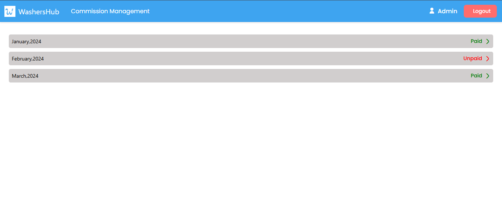

# WashersHub Web Portal UI

WashersHub Web Portal is a comprehensive admin dashboard designed to streamline car wash business operations. This powerful React-based platform enables administrators and managers to efficiently manage vendors, track orders, handle commissions, and configure system settings in real-time.

The portal serves as a centralized hub where administrators can monitor vendor performance, process orders, manage commission structures, and maintain various system configurations. With its intuitive interface and robust features, WashersHub simplifies the complex task of managing multiple car wash vendors and their operations across different locations.


## 📑 Table of Contents
- [Demo](#-demo)
- [Authentication](#-authentication)
- [Screenshots](#-screenshots)
- [Design & Navigation](#-design--navigation)
- [Key Features](#-key-features)
- [Tech Stack](#-tech-stack)
- [Responsive Design](#-responsive-design)
- [Getting Started](#-getting-started)
  - [Prerequisites](#prerequisites)
  - [Installation](#installation)
- [Authors](#-authors)
- [Acknowledgments](#-acknowledgments)

## 🚀 Demo

Watch the [Live Demo](https://QaiserEjaz.github.io/washershub-web-portal)

## 🔐 Authentication
Default credentials for demo purposes :

- Admin:
  - Email: admin@washershub.com
  - Password: admin123
- Manager:
  - Email: manager@washershub.com
  - Password: manager123

## 📸 Screenshots

### Authentication


### Dashboard Views
- Vendors Management
  
- Orders Management
  
- Commission Management
  
- Complaint
  
- Order Details
  
- Project Config Cities
  

## 🎨 Design & Navigation

View our interactive prototype: [WashersHub Portal Design](https://app.uizard.io/p/e9f41458)

## 🔑 Key Features

- 👥 **Vendor Management**
  - View and manage vendors
  - Track vendor performance
  - Commission management
  - Status updates
  - Add/Edit/Delete vendors
  - View vendor details and performance
  - Track vendor orders and commission

- 📦 **Order Management**
  - Real-time order tracking
  - Order history
  - Status updates
 
- 💰 **Commission Management**
  - Set commission rates
  - Track earnings
  - Commission reports
  - Commission calculations

- 🔧 **System Configuration**
  - Category management
  - Country settings
  - Commission rates
  - Project settings

## 💻 Tech Stack
- React.js
- Bootstrap 5
- React Router v6
- Context API for state management

## 📱 Responsive Design
The portal is fully responsive and works on:

- 💻 Desktop
- 📱 Tablet
- 📱 Mobile

## 🚀 Getting Started

### Prerequisites
- Node.js (v14 or higher)
- npm (v6 or higher)

### Installation

1. Clone the repository
```bash
git clone https://github.com/QaiserEjaz/washershub-webportal-ui.git
cd washershub-webportal-ui
```
## 👥 Authors
- **Syed Rafay Abrar** - *Initial work*- [Syed Rafay Abrar](https://github.com/SyedRafayAbrar)
- **Qaiser Ejaz** - *Contributor* - 
[QaiserEjaz](https://github.com/QaiserEjaz)

## 🙏 Acknowledgments
- Create React App
- Bootstrap Team
- React Router Team
- Flaticon